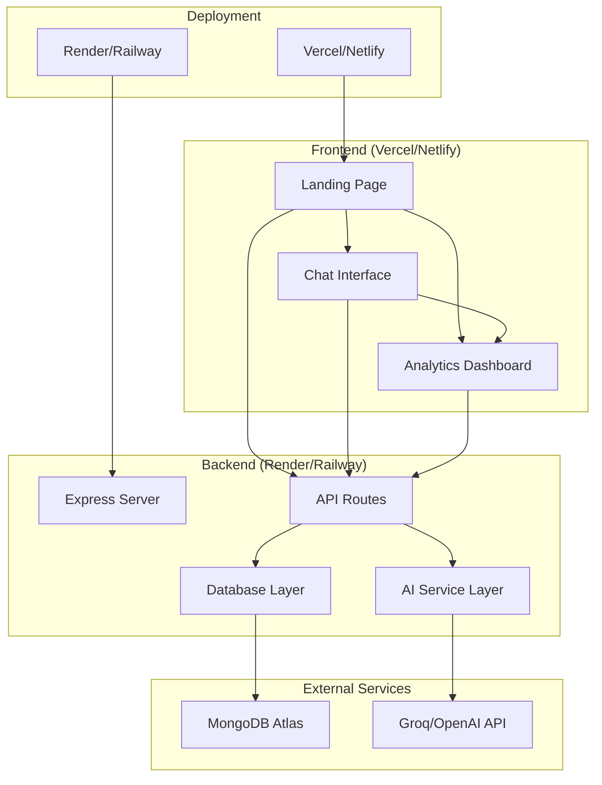

# Design Document

## Overview

EchoMe X is designed as a sophisticated AI Twin platform MVP with advanced personality assessment and premium user experience. The architecture features a modular frontend with component-based CSS system and a personality-driven backend API. The system allows users to create highly personalized AI twins through comprehensive psychological assessment, delivering ChatGPT-quality interactions through a premium interface backed by Groq API integration.

## Architecture

### High-Level Architecture



### Technology Stack

**Frontend:**
- HTML5/CSS3/JavaScript (ES6+) with modular architecture
- Component-based CSS system (base.css, components.css, layout.css, pages.css, utilities.css)
- Inter font family for premium typography
- Vanilla JS with advanced DOM manipulation and API integration
- CSS Grid/Flexbox with responsive design system
- Premium ChatGPT-inspired UI with dark theme

**Backend:**
- Node.js with Express.js framework
- MongoDB with Mongoose ODM for personality profiles
- Axios for Groq API integration
- CORS middleware and comprehensive error handling
- UUID for unique twin identification
- Environment-based configuration with dotenv

**External Integrations:**
- Groq API for personality-driven AI responses
- MongoDB Atlas for personality profile storage
- Social media APIs (optional permissions)

**Deployment:**
- Frontend: Vercel with static hosting
- Backend: Render with Node.js runtime
- Database: MongoDB Atlas cloud hosting

## Components and Interfaces

### Frontend Components

#### 1. Landing Page (`index.html`)
- **Purpose**: Premium twin creation with personality assessment
- **Components**:
  - Hero section with premium branding and call-to-action
  - Step-by-step personality assessment modal (11 questions)
  - Big Five personality trait mapping system
  - Social media permissions interface
  - Loading animation with twin creation progress
- **API Integration**: POST `/api/create-personality-twin`

#### 2. Chat Interface (`chat.html`)
- **Purpose**: Premium ChatGPT-inspired chat with personality-driven AI
- **Components**:
  - Sidebar navigation with twin management
  - Premium black-themed chat interface
  - Message bubbles with user/assistant avatars
  - Auto-resizing textarea with send button
  - Typing indicators and welcome suggestions
  - Twin switching and management controls
- **API Integration**: POST `/api/chat-personality`, GET `/api/debug-twins`

#### 3. Analytics Dashboard (`analytics.html`)
- **Purpose**: Comprehensive analytics with visual insights
- **Components**:
  - Animated metrics cards with hover effects
  - Interactive charts showing engagement trends
  - Popular topics analysis with progress bars
  - Recent activity feed with timestamps
  - Real-time metric updates with smooth animations
- **API Integration**: GET `/api/analytics`

### Backend Components

#### 1. Express Server (`server.js`)
- **Purpose**: Main application server
- **Responsibilities**:
  - Route handling
  - Middleware configuration
  - Database connection
  - Error handling

#### 2. API Routes (`/routes`)

##### `/api/create-personality-twin` (POST)
- **Purpose**: Create personality-driven AI twin from assessment data
- **Input**: `{ name, gender, bigFiveTraits, communicationStyle, cognitiveStyle, socialMediaPermissions }`
- **Output**: `{ success, twinId, message }`
- **Process**: Map personality traits → Create comprehensive profile → Save to MongoDB → Return twin ID

##### `/api/chat-personality` (POST)
- **Purpose**: Generate personality-driven AI responses using Groq API
- **Input**: `{ message, twinId }`
- **Output**: `{ success, response, timestamp }`
- **Process**: Fetch personality profile → Build personality-aware prompt → Call Groq API → Return response

##### `/api/analytics` (GET)
- **Purpose**: Retrieve comprehensive engagement analytics
- **Input**: None (uses stored twin data)
- **Output**: `{ followers, engagementRate, totalInteractions, averageResponseTime, trends }`
- **Process**: Aggregate twin data → Calculate metrics → Return formatted analytics

##### `/api/debug-twins` (GET)
- **Purpose**: Twin management and debugging information
- **Input**: None
- **Output**: `{ twins: [{ id, name, conversationCount, hasPersonality }] }`
- **Process**: Query all twins → Format for UI → Return twin list

#### 3. AI Service Layer (`/services/aiService.js`)
- **Purpose**: Handle AI API integrations
- **Functions**:
  - `generateResponse(persona, message, history)`
  - `buildPrompt(persona, context)`
  - `callGroqAPI()` / `callOpenAI()`
- **Error Handling**: Fallback responses, rate limiting

#### 4. Database Layer (`/models`)
- **Purpose**: Data persistence and retrieval
- **Models**: User, Conversation, Analytics

## Data Models

### Twin Model
```javascript
{
  _id: ObjectId,
  name: String,
  userId: String, // Unique identifier
  persona: String, // Legacy field for basic twins
  personalityProfile: {
    gender: String,
    bigFiveTraits: {
      extraversion: Number, // 0-1 scale
      openness: Number,
      conscientiousness: Number,
      agreeableness: Number,
      neuroticism: Number
    },
    communicationStyle: {
      formality: String, // 'formal' | 'casual'
      expressiveness: String, // 'expressive' | 'reserved'
      supportiveness: String, // 'supportive' | 'direct'
      optimism: Number // 0-1 scale
    },
    cognitiveStyle: {
      thinking_preference: String, // 'practical' | 'creative'
      decision_making: String, // 'emotional' | 'logical'
      planning_approach: String, // 'decisive' | 'flexible'
      creativity_level: Number // 0-1 scale
    },
    socialMediaPermissions: Object, // Platform permissions
    responses: Object // Raw quiz responses
  },
  conversationHistory: [{
    userMessage: String,
    twinResponse: String,
    timestamp: Date
  }],
  createdAt: Date,
  updatedAt: Date
}
```

### Conversation Model
```javascript
{
  _id: ObjectId,
  userId: ObjectId,
  messages: [{
    sender: String, // 'user' or 'twin'
    content: String,
    timestamp: Date
  }],
  createdAt: Date
}
```

### Analytics Model
```javascript
{
  _id: ObjectId,
  userId: ObjectId,
  metrics: {
    totalInteractions: Number,
    followers: Number,
    engagementRate: Number,
    growthRate: Number
  },
  lastUpdated: Date
}
```

## Error Handling

### Frontend Error Handling
- **Network Errors**: Display user-friendly messages
- **Validation Errors**: Inline form validation
- **API Errors**: Parse error responses and show appropriate feedback
- **Loading States**: Show spinners during API calls

### Backend Error Handling
- **Validation Errors**: Return 400 with detailed error messages
- **Database Errors**: Return 500 with generic error message
- **AI API Errors**: Implement fallback responses
- **Rate Limiting**: Return 429 with retry information
- **Authentication Errors**: Return 401/403 as needed

### Error Response Format
```javascript
{
  success: false,
  error: {
    code: "ERROR_CODE",
    message: "User-friendly error message",
    details: "Technical details (development only)"
  }
}
```

## Testing Strategy

### Frontend Testing
- **Manual Testing**: Cross-browser compatibility testing
- **User Flow Testing**: Complete user journeys through all three pages
- **Responsive Testing**: Mobile and desktop layouts
- **API Integration Testing**: Mock API responses for development

### Backend Testing
- **Unit Tests**: Individual function testing with Jest
- **Integration Tests**: API endpoint testing with Supertest
- **Database Tests**: MongoDB connection and CRUD operations
- **AI Service Tests**: Mock external API calls

### Test Coverage Areas
1. **Twin Creation Flow**: Form validation, data persistence
2. **Chat Functionality**: Message sending, AI response generation
3. **Analytics Display**: Data retrieval and formatting
4. **Error Scenarios**: Network failures, invalid inputs
5. **Performance**: Response times, concurrent users

### Testing Tools
- **Jest**: Unit and integration testing
- **Supertest**: HTTP assertion testing
- **MongoDB Memory Server**: In-memory database for tests
- **Postman/Insomnia**: Manual API testing

## Security Considerations

### Data Protection
- Input validation and sanitization
- MongoDB injection prevention
- XSS protection in frontend
- CORS configuration

### API Security
- Rate limiting on all endpoints
- API key protection for external services
- Environment variable security
- Error message sanitization

### Deployment Security
- HTTPS enforcement
- Secure headers configuration
- Environment-specific configurations
- Database connection security