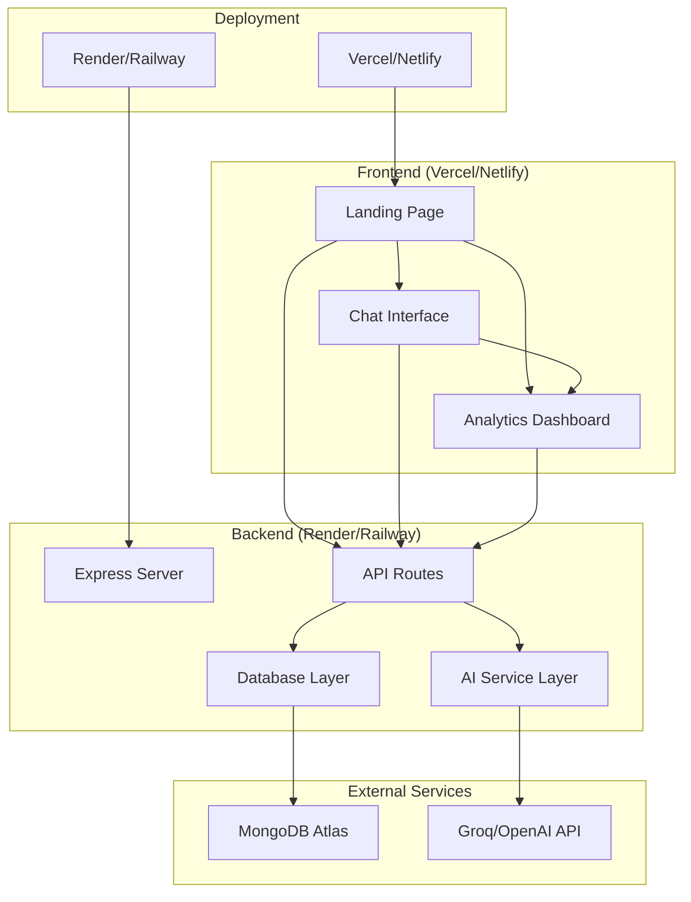

# Design Document

## Overview

EchoMe X is designed as a lightweight AI Twin platform MVP with a clean separation between frontend and backend services. The architecture prioritizes simplicity, quick deployment, and scalability for future enhancements. The system allows users to create AI twins that mimic their communication style through a simple three-page web interface backed by a RESTful API.

## Architecture

### High-Level Architecture



### Technology Stack

**Frontend:**
- HTML5/CSS3/JavaScript (ES6+)
- Vanilla JS for DOM manipulation and API calls
- CSS Grid/Flexbox for responsive layouts
- Fetch API for HTTP requests

**Backend:**
- Node.js with Express.js framework
- MongoDB with Mongoose ODM
- CORS middleware for cross-origin requests
- Environment variables for configuration

**External Integrations:**
- Groq API or OpenAI API for AI responses
- MongoDB Atlas for database hosting

**Deployment:**
- Frontend: Vercel or Netlify
- Backend: Render or Railway
- Database: MongoDB Atlas

## Components and Interfaces

### Frontend Components

#### 1. Landing Page (`index.html`)
- **Purpose**: Twin creation interface
- **Components**:
  - Hero section with app description
  - Twin creation form (name, persona details)
  - Navigation to other pages
- **API Integration**: POST `/api/train`

#### 2. Chat Interface (`chat.html`)
- **Purpose**: Real-time chat with AI twin
- **Components**:
  - Chat message container
  - Message input field and send button
  - Twin persona display
  - Message history
- **API Integration**: POST `/api/chat`

#### 3. Analytics Dashboard (`analytics.html`)
- **Purpose**: Display engagement metrics
- **Components**:
  - Metrics cards (followers, engagement rate)
  - Charts/graphs for visual data
  - Twin performance overview
- **API Integration**: GET `/api/analytics/:userId`

### Backend Components

#### 1. Express Server (`server.js`)
- **Purpose**: Main application server
- **Responsibilities**:
  - Route handling
  - Middleware configuration
  - Database connection
  - Error handling

#### 2. API Routes (`/routes`)

##### `/api/train` (POST)
- **Purpose**: Create and store AI twin
- **Input**: `{ name, persona, traits, communicationStyle }`
- **Output**: `{ success, userId, message }`
- **Process**: Validate input → Save to MongoDB → Return user ID

##### `/api/chat` (POST)
- **Purpose**: Generate AI twin responses
- **Input**: `{ userId, message, conversationHistory }`
- **Output**: `{ response, timestamp }`
- **Process**: Fetch user persona → Build AI prompt → Call Groq/OpenAI → Return response

##### `/api/analytics/:userId` (GET)
- **Purpose**: Retrieve engagement analytics
- **Input**: User ID from URL params
- **Output**: `{ followers, engagementRate, totalInteractions, growthRate }`
- **Process**: Query user data → Calculate metrics → Return analytics

#### 3. AI Service Layer (`/services/aiService.js`)
- **Purpose**: Handle AI API integrations
- **Functions**:
  - `generateResponse(persona, message, history)`
  - `buildPrompt(persona, context)`
  - `callGroqAPI()` / `callOpenAI()`
- **Error Handling**: Fallback responses, rate limiting

#### 4. Database Layer (`/models`)
- **Purpose**: Data persistence and retrieval
- **Models**: User, Conversation, Analytics

## Data Models

### User Model
```javascript
{
  _id: ObjectId,
  name: String,
  persona: {
    traits: [String],
    communicationStyle: String,
    background: String,
    interests: [String]
  },
  createdAt: Date,
  updatedAt: Date
}
```

### Conversation Model
```javascript
{
  _id: ObjectId,
  userId: ObjectId,
  messages: [{
    sender: String, // 'user' or 'twin'
    content: String,
    timestamp: Date
  }],
  createdAt: Date
}
```

### Analytics Model
```javascript
{
  _id: ObjectId,
  userId: ObjectId,
  metrics: {
    totalInteractions: Number,
    followers: Number,
    engagementRate: Number,
    growthRate: Number
  },
  lastUpdated: Date
}
```

## Error Handling

### Frontend Error Handling
- **Network Errors**: Display user-friendly messages
- **Validation Errors**: Inline form validation
- **API Errors**: Parse error responses and show appropriate feedback
- **Loading States**: Show spinners during API calls

### Backend Error Handling
- **Validation Errors**: Return 400 with detailed error messages
- **Database Errors**: Return 500 with generic error message
- **AI API Errors**: Implement fallback responses
- **Rate Limiting**: Return 429 with retry information
- **Authentication Errors**: Return 401/403 as needed

### Error Response Format
```javascript
{
  success: false,
  error: {
    code: "ERROR_CODE",
    message: "User-friendly error message",
    details: "Technical details (development only)"
  }
}
```

## Testing Strategy

### Frontend Testing
- **Manual Testing**: Cross-browser compatibility testing
- **User Flow Testing**: Complete user journeys through all three pages
- **Responsive Testing**: Mobile and desktop layouts
- **API Integration Testing**: Mock API responses for development

### Backend Testing
- **Unit Tests**: Individual function testing with Jest
- **Integration Tests**: API endpoint testing with Supertest
- **Database Tests**: MongoDB connection and CRUD operations
- **AI Service Tests**: Mock external API calls

### Test Coverage Areas
1. **Twin Creation Flow**: Form validation, data persistence
2. **Chat Functionality**: Message sending, AI response generation
3. **Analytics Display**: Data retrieval and formatting
4. **Error Scenarios**: Network failures, invalid inputs
5. **Performance**: Response times, concurrent users

### Testing Tools
- **Jest**: Unit and integration testing
- **Supertest**: HTTP assertion testing
- **MongoDB Memory Server**: In-memory database for tests
- **Postman/Insomnia**: Manual API testing

## Security Considerations

### Data Protection
- Input validation and sanitization
- MongoDB injection prevention
- XSS protection in frontend
- CORS configuration

### API Security
- Rate limiting on all endpoints
- API key protection for external services
- Environment variable security
- Error message sanitization

### Deployment Security
- HTTPS enforcement
- Secure headers configuration
- Environment-specific configurations
- Database connection security